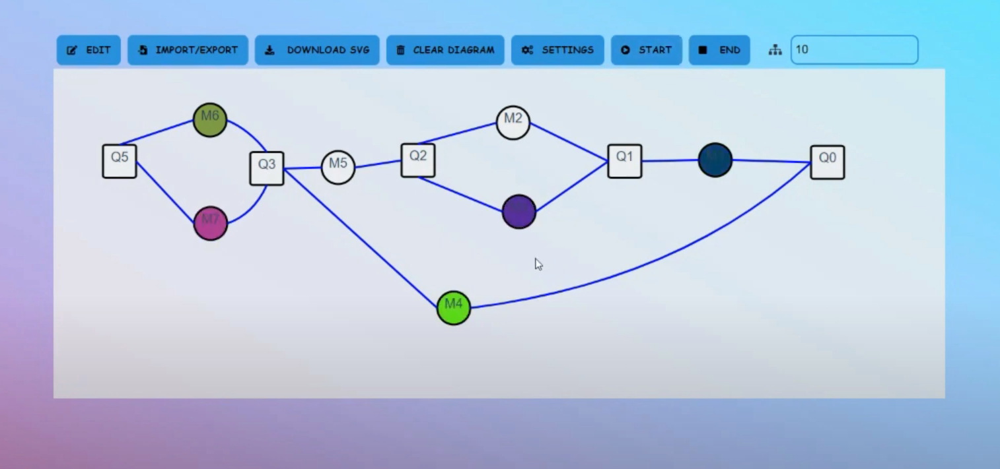

# Producer-ConsumerSimlulationProgram-Vue.js-SpringBoot



## Option
* Edit Diagram 
* Import / Export Diagram
* Download SVG 
* Clear Diagram
* Diagram Settings
* Start Simulation
* End Simulation
* Number of products


## Project setup

```
npm install
```

### Compiles and hot-reloads for development

```
npm run serve
```

### Compiles and minifies for production

```
npm run build
```

### Lints and fixes files

```
npm run lint
```

### Customize configuration

See [Configuration Reference](https://cli.vuejs.org/config/).


## Design Patterns
* 1. Producer/consumer:
  * we applied that by making each machine a thread that works relying on a queue so
    that if the queue is empty the thread stops and if the queue has an element it
    starts.
    
* 2. Snapshot:
  * we applied that by making a memento class that has a queue for states and make
    an Originator class that saves a queue in it we use it to save the color queue to
    reuse it in case we redo the simulation.

* 3. Observer:
  * we applied it by making our own queue class and make it extend observable
    and make the machine extends observer and each machine observes the
    queue that is connected to it to know if it showed start or not.

* 4. Singleton:
  * we applied it by making a singleton class to hold some data that we want our
    whole program to access which is the color of each machine so that our 1.
    controller class can know the colors of the machines without having to access
    each machine and the color gets changed by the machine itself.
    We use it to hold the status of the process and we do that by sending the number
    of the products and the final queue so we check the number of products in the final
    queue and if it equals the total number of the products then we have reached the
    end of the simulation and we end the machine threads.

## Contributing
Pull requests are welcome. For major changes, please open an issue first to discuss what you would like to change.

## License
[MIT](https://choosealicense.com/licenses/mit/)
